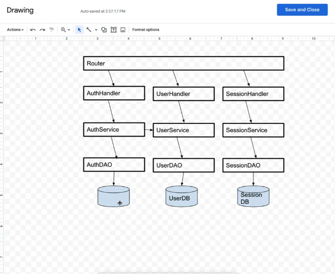

# Quickstart:

Run it locally from my `main.py` file.

```bash
uvicorn main:app --reload
```

## Ec2 Instance:

ssh -i "splitz_ec2.pem" ubuntu@ec2-3-14-255-133.us-east-2.compute.amazonaws.com

### How to create a migration using `alembic`:

1. Create a migration file:

```bash
alembic revision -m "remove temporary users column and add profile and room picture S3 URL columns"

>>> Generating /home/ubuntu/splitz/alembic/versions/9ff2d6bc8ce3_remove_temporary_users_column_and_add_.py ...  done
```

2: Modify the migration file `9ff2d6bc8ce3_remove_temporary_users_column_and_add_.py`

3. Run the migration:

```bash
alembic upgrade head
```

# Overview

This is the backend API for Splitz
It consists of a backend API which stores the data in XXXX and listens on port 8000. Authentication is done using Twilio xxxxx
The frontend is in React, and the app can be downloaded from xxxx.
It connects to the API for all functionality.

# Install

Requires Python, ideally on Linux or else Mac.

1.  Download source code from Github
    > GitHub blah blah
2.  Copy entire source folder into /usr/local/splitz (INSTALL_DIR)
3.  Edit xxxx.init and set the Postgres directory and AWS S3 bucket and also Twilio xxxx and also INSTALL_DIR
4.  Start the API using (cd $INSTALL_DIR ; python main.py) &
5.  Test the API by doing a : python test_api.py
6.  Look in $INSTALL_DIR/logs directory to see if there are any errors

# DESIGN

Data is stored in Postgres and in EC2.

## **Application Architecture Design:**

The application follows a modular, object-oriented design that separates concerns into distinct classes, each with their own responsibilities. This design includes a `Database` class for database operations, a `UserService` class for user-related business logic, and a `UserController` class for handling HTTP requests and responses.

#### **Key Benefits:**

1. **Modularity**: Each class has a specific role, making the code easier to understand and maintain.

2. **Reusability**: The classes can be reused across the application, promoting code efficiency and consistency.

3. **Testability**: Each class can be tested independently, facilitating robust and comprehensive testing.

4. **Flexibility**: Changes in one class (e.g., database interactions) do not affect others, making the codebase more adaptable to future modifications.

This design does not inherently add security but provides a structured framework within which secure coding practices can be effectively implemented.



## Next Steps

Do what i did in Scaleable software architectures class. First, create a way to upload images sent from the clients side. Then the backend takes that image and puts it into an s3 bucket with a UUID as its folder name. This folder on s3 represents the GROUP UUID to which all these uploaded receipt images belong. Anyone that has this UUID in their "groups" field of their database record, can access all the images within subdirectory on s3. Maybe even add a list of all Group UUID's a User is in.

a `room` is going to represented as a UUID as the primary key. the User and Rooms table will be a `many-to-many` relationship. For this we will be using an _association table_:

`UserRoom Association Table`:
`   user_id`: Foreign Key referencing Users
`    room_id`: Foreign Key referencing Rooms

`Rooms Table`:
`   room_id:`Primary key (UUID)
`   room_name`: Name of the room
`   room_password`: Password for the room (hashed + salt)
